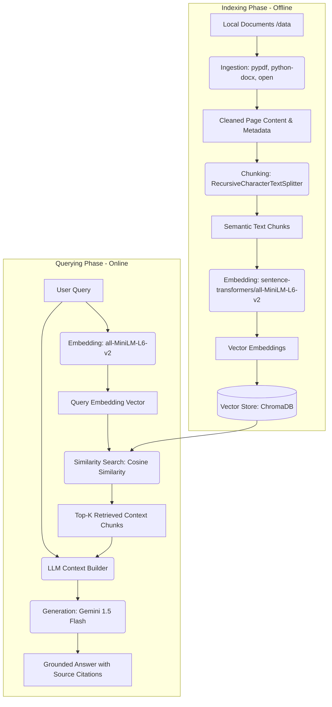

# RAG Document Q&A Bot — AI Engineering Internship Assignment

A functional Retrieval-Augmented Generation (RAG) pipeline built from scratch using Python. The system allows users to ask natural language questions against a knowledge base of 5 documents (spanning PDF, DOCX, and TXT formats) and receive accurate, grounded answers complete with inline source citations.

---

## 🛠️ Tech Stack

- **Language**: Python 3.14 (Supports Python 3.11+)
- **Document Ingestion**:
  - `pypdf` (v6.13.3) — Pure-Python PDF parsing (replaces native C dependencies like PyMuPDF for universal compatibility)
  - `python-docx` (v1.1.2) — Microsoft Word (.docx) document parsing
- **Text Chunking**:
  - `langchain-text-splitters` (v0.2.4) — Semantic paragraph-based text splitting
- **Vector Embeddings**:
  - `sentence-transformers` (v3.0.1) — Local semantic text embeddings using PyTorch
  - `torch` (v2.12.1) — Machine learning library providing tensor computations
- **Vector Database**:
  - `chromadb` (v0.5.3) — Persistent, single-file serverless vector database
- **LLM Answer Generation**:
  - `google-generativeai` (v0.7.2) — Google Gemini 1.5 Flash API for grounded output generation
- **Interfaces**:
  - `streamlit` (v1.36.0) — Premium dashboard web interface
  - `rich` (v13.7.1) — Beautiful CLI interface terminal formatting

---

## 🏗️ Architecture Overview

The RAG pipeline operates in two distinct phases: **Indexing (Offline)** and **Querying (Online)**.



---

## ⚙️ Key Technical Decisions

### 1. Chunking Strategy
- **Choice**: `RecursiveCharacterTextSplitter` (800 character chunk size, 150 character overlap).
- **Reasoning**: This strategy uses a prioritized list of separators (`\n\n` for paragraphs, `\n` for sentences, ` ` for words) to keep semantic content intact. By splitting recursively, it ensures paragraphs and sentences are not split down the middle unless they exceed the chunk limit, preserving maximum semantic context. The 150-character overlap prevents information loss near boundaries.

### 2. Embedding Model
- **Choice**: `sentence-transformers/all-MiniLM-L6-v2`
- **Reasoning**: This is a local, lightweight (90MB), and extremely fast model that runs on CPU without requiring CUDA or an external API key. It maps text to a 384-dimensional dense vector space and is highly optimized for semantic search and sentence similarity tasks.

### 3. Vector Database
- **Choice**: `ChromaDB` (Persistent)
- **Reasoning**: ChromaDB is a serverless, developer-friendly database that runs inside the Python process and persists data to a local disk directory (`./chroma_db`). It allows a clean separation of the indexing step (writing) and querying step (reading) without needing to configure or pay for a cloud vector database.

### 4. Generation LLM
- **Choice**: `Google Gemini 1.5 Flash`
- **Reasoning**: Gemini 1.5 Flash is fast, features high reasoning quality, and offers a generous free tier for developers. By providing a strict system prompt instruction, it enforces strict grounding (only using the context blocks) and formats correct source citations.

---

## 🚀 Setup Instructions

### 1. Clone the Repository
```bash
git clone <your-repository-url>
cd "AI internship assign"
```

### 2. Configure Environment Variables
Create a `.env` file in the root directory by copying the template:
```bash
cp .env.example .env
```
Open `.env` and enter your Google Gemini API key:
```env
GOOGLE_API_KEY=AIzaSy... (Your API Key)
```

### 3. Install Dependencies
Make sure you have Python 3.11+ installed. Install the required libraries:
```bash
pip install -r requirements.txt
```

### 4. Index the Documents
Run the one-time indexing script to process files in `/data` and build the vector database:
```bash
python index.py
```

### 5. Run the Q&A Bot
You can run the bot in two ways:

#### A. Streamlit Web UI (Recommended)
```bash
streamlit run app.py
```

#### B. Command Line Interface (CLI)
```bash
python query.py
```

---

## 📋 Example Queries & Expected Answers

1. **Query**: *Explain the core mathematical formula of the self-attention mechanism in Transformers.*
   - **Answer Theme**: References `Attention Is All You Need` and shows the formula `Attention(Q,K,V) = softmax(Q K^T / sqrt(d_k)) V`.
2. **Query**: *What is the EU AI Act risk levels and how does it classify AI risk?*
   - **Answer Theme**: References `artificial_intelligence_ethics.txt` and details how risk is classified from minimal to unacceptable risk.
3. **Query**: *What strategies are mentioned for climate change mitigation in transportation?*
   - **Answer Theme**: References `climate_change_mitigation_strategies.txt` and mentions EVs, SAFs, green hydrogen, and biofuels.
4. **Query**: *What is the history of the Apollo 11 moon landing?*
   - **Answer Theme**: References `space_exploration_milestones.txt` and mentions the July 20, 1969 landing with Neil Armstrong and Buzz Aldrin.
5. **Query**: *Explain decorators and generators in Python.*
   - **Answer Theme**: References `python_programming_fundamentals.docx` and explains decorator syntax (`@`) and generator memory-efficiency (`yield`).
6. **Query (Unanswerable)**: *What is the capital of France?*
   - **Answer Theme**: Bot strictly refuses to answer and states that the provided documents do not contain the information.

---

## ⚠️ Known Limitations

1. **Short Documents / Lack of Metadata**: For document types like DOCX and TXT, page numbers are not natively structured. The system groups paragraphs and defaults to page/section 1.
2. **Table Parsing**: Pure-text extraction can struggle with complex tables in PDFs or DOCX, occasionally losing structure.
3. **Keyword Dependency vs Semantic Search**: While sentence-transformers excel at semantic search, extremely specific keyword searches (like exact spelling codes) might rank lower than general semantic concepts.
"# AI-Document-Q-A-Assistant" 
